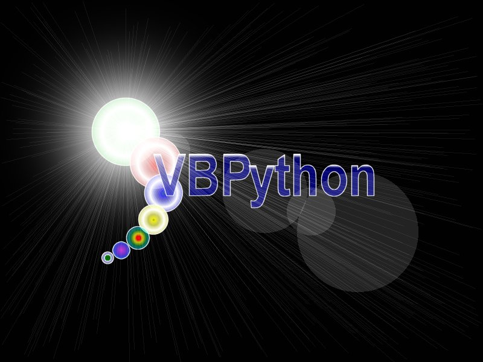



## a \_VBPython 1\.0c\_4\-player SNAKES game with power\-ups\!\_try it\!

### Description

Very addictive Snakes-game. Large screen (small graphics), 4 players, various power-ups to collect, changeable maps, various options. Good to play in multiplayer.

Doesn't contain a map editor yet, and has only 1 map (see "readme_maps.txt").

Please VOTE and leave comments on how to improve this game, bugs, add power-ups, tuning, more settings, etc...
 
### More Info
 

             |
---                |---
**Submitted On**   |2002-06-11 12:08:28
**By**             |[Enrico Bertozzi](https://github.com/Planet-Source-Code/PSCIndex/blob/master/ByAuthor/enrico-bertozzi.md)
**Level**          |Intermediate
**User Rating**    |4.7 (28 globes from 6 users)
**Compatibility**  |VB 5\.0, VB 6\.0
**Category**       |[Games](https://github.com/Planet-Source-Code/PSCIndex/blob/master/ByCategory/games__1-38.md)
**World**          |[Visual Basic](https://github.com/Planet-Source-Code/PSCIndex/blob/master/ByWorld/visual-basic.md)
**Archive File**   |[a\_\_VBPytho928926112002\.zip](https://github.com/Planet-Source-Code/enrico-bertozzi-a-vbpython-1-0c-4-player-snakes-game-with-power-ups-try-it__1-35710/archive/master.zip)

